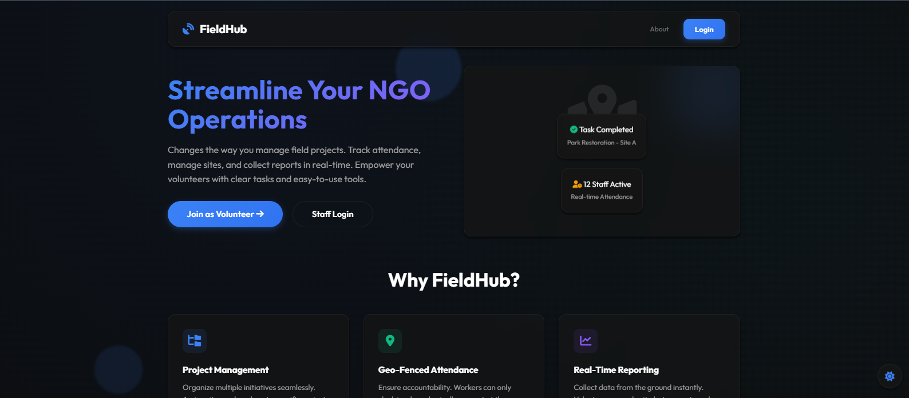
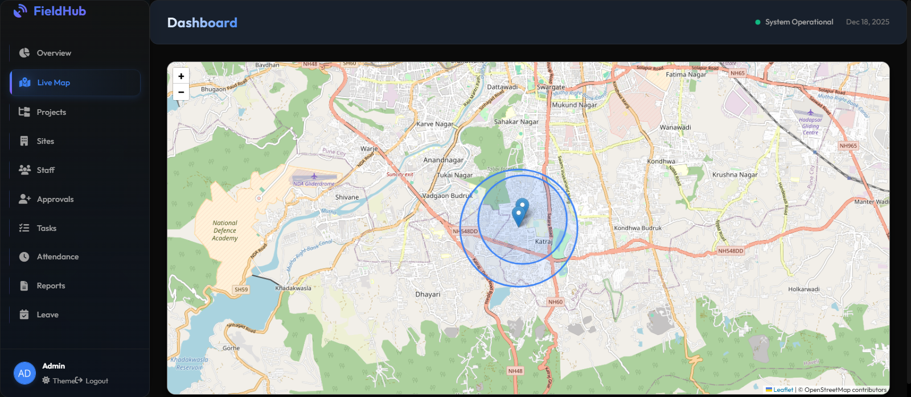
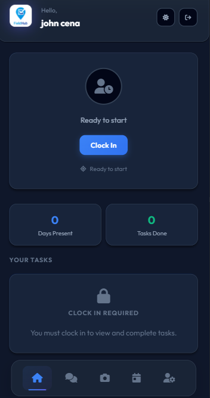

# Field Hub 🌍


**A comprehensive web-based platform designed to revolutionize how NGOs manage field work, reports, and volunteer coordination.** Field Hub bridges the gap between ground-level operations and administrative oversight with real-time data and intuitive tools.

---

## 🚀 Live Demo
### [🔗 Launch Field Hub Application](https://thefieldhub.web.app)

---

## 🧠 Problem Statement
NGOs often struggle with:
*   **Manual Tracking**: Reliance on paper trails and phone calls for monitoring field activities.
*   **Data Fragmentation**: Scattered reports making it difficult to analyze impact or progress.
*   **Coordination Gaps**: Lack of real-time visibility into volunteer locations and status.

## 💡 The Solution
Field Hub centralizes operations into a single, cohesive ecosystem:
*   **Unified Command Center**: A role-based platform offering distinct experiences for Admins (Web Dashboard) and Field Staff (Mobile-First Interface).
*   **Interactive Insights**: Admins gain transparency through visual analytics, maps, and live data feeds.
*   **Operational Efficiency**: Streamlined reporting, attendance, and task management reduce administrative overhead.

---

## 🔍 Key Functionalities

### For Field Staff
*   **📱 Responsive Design**: Optimized for multiple screen sizes.
*   **📍 GPS Attendance**: Clock in/out only when within designated site geofences.
*   **📝 Quick Reporting**: Submit photo-verified situation reports instantly.
*   **🔔 Task Management**: Receive and update assigned tasks in real-time.

### For Admins
*   **📊 Master Dashboard**: Overview of active staff, completed tasks, and pending leaves.
*   **🗺️ Live Map Tracking**: Visualize staff locations and operational sites on an interactive map.
*   **👥 User Management**: Approve volunteer registrations and manage staff roles.
*   **📈 Data Analytics**: View trends in attendance and activity logs.

---

## 🎯 Why This Project Matters
Unlike simple record-keeping tools, Field Hub focuses on **accountability and impact**:
1.  **Transparency**:Stakeholders can see exactly where and when work is happening.
2.  **Safety**: Real-time location tracking ensures the safety of volunteers in the field.
3.  **Scalability**: Built on cloud infrastructure to grow with the NGO's needs without hardware constraints.

---

## 📸 Interface Preview

<div align="center">
  <h3>Landing & Home</h3>
  
</div>

<div align="center">
  <h3>Admin Command Center</h3>
  
</div>

<div align="center">
  <h3>Field Worker </h3>
  
</div>

---

## 🛠 Tech Stack

### Frontend


### Backend & Services (Firebase)


---

## 📂 Project Structure
```text
Field-Hub/
│
├── 📁 public/                 # Static assets (images, icons)
├── 📁 screenshots/            # Project showcase images
├── 📁 styles/                 # Global styling and themes
├── 📁 js/                     # Application logic
│   ├── app_v2.js              # Core UI and event handling
│   ├── store_v2.js            # State management & helpers
│   └── firebase-config.js     # Firebase initialization
├── 📄 index.html              # Landing page (Public view)
├── 📄 app.html                # Main application (Auth protected)
├── ⚙️ sw.js                   # Service Worker (PWA capabilities)
├── 🔧 firebase.json           # Firebase CLI configuration
├── 🔒 firestore.rules         # Database security rules
└── 📝 README.md               # Project documentation
```


<div align="center">
  <p>Made with ❤️ for Social Good</p>
</div>
