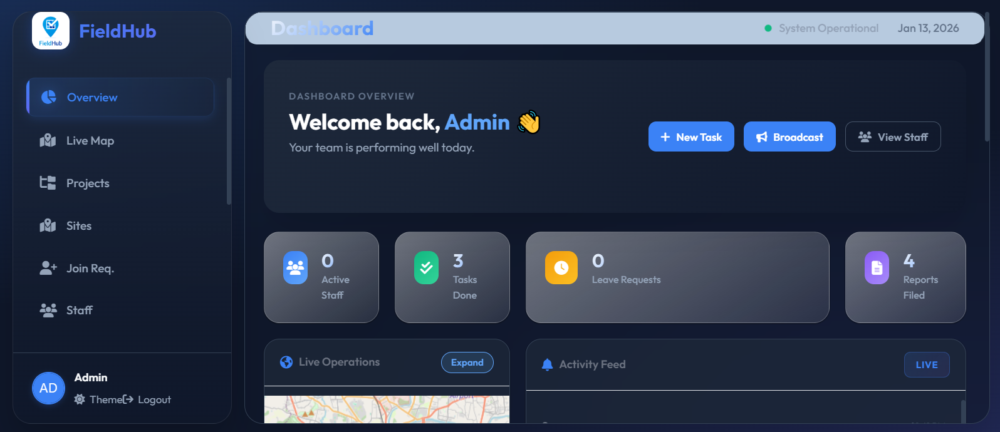
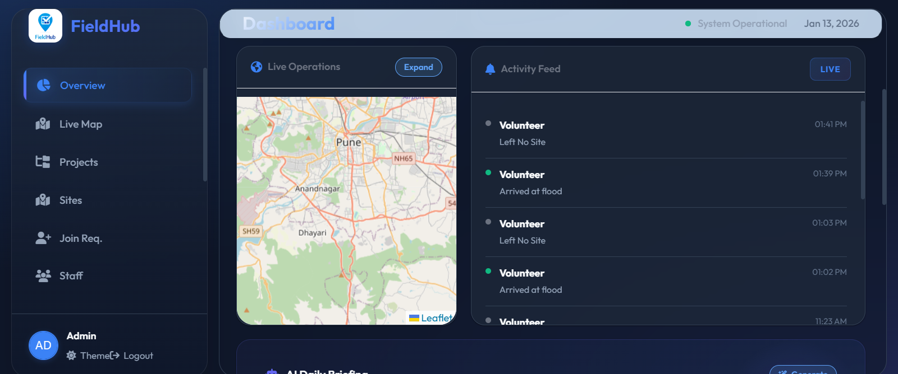
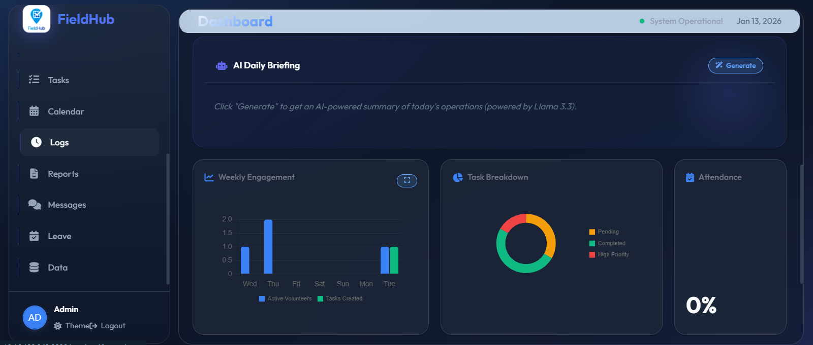

# Field Hub 🌍


**A comprehensive web-based platform designed to revolutionize how NGOs manage field work, reports, and volunteer coordination.** Field Hub bridges the gap between ground-level operations and administrative oversight with real-time data, AI-powered features, and intuitive tools.

---

## 🚀 Live Demo
### [🔗 Launch Field Hub Application](https://thefieldhub.web.app)

---

## 🧠 Problem Statement
NGOs often struggle with:
*   **Manual Tracking**: Reliance on paper trails and phone calls for monitoring field activities.
*   **Data Fragmentation**: Scattered reports making it difficult to analyze impact or progress.
*   **Coordination Gaps**: Lack of real-time visibility into volunteer locations and status.
*   **Language Barriers**: Field workers may speak different regional languages.

## 💡 The Solution
Field Hub centralizes operations into a single, cohesive ecosystem:
*   **Unified Command Center**: A role-based platform offering distinct experiences for Admins (Web Dashboard) and Field Staff (Mobile-First Interface).
*   **Interactive Insights**: Admins gain transparency through visual analytics, maps, and live data feeds.
*   **AI-Powered Tools**: Translation, voice input, and smart report generation in 23+ languages.
*   **Operational Efficiency**: Streamlined reporting, attendance, and task management reduce administrative overhead.

---

## 🔍 Key Functionalities

### For Field Staff
*   **📱 Responsive Design**: Optimized for multiple screen sizes.
*   **📍 GPS Attendance**: Clock in/out only when within designated site geofences.
*   **📝 Smart Reporting**: Submit reports using templates, voice input, or AI assistance.
*   **🎤 Voice-to-Text**: Speak in your native language (Hindi, Tamil, Bengali, etc.).
*   **✨ AI Report Helper**: Answer simple questions, AI writes your report.
*   **🔔 Task Management**: Receive and update assigned tasks in real-time.

### For Admins
*   **📊 Master Dashboard**: Overview of active staff, completed tasks, and pending leaves.
*   **🗺️ Live Map Tracking**: Visualize staff locations and operational sites on an interactive map.
*   **👥 User Management**: Approve volunteer registrations and manage staff roles.
*   **📈 Data Analytics**: View trends in attendance and activity logs.
*   **🤖 AI Daily Briefing**: Get AI-generated operational insights every morning.
*   **🌐 Multi-language Translation**: Translate reports and tasks to 23 Indian languages.

---

## 🤖 AI Features

| Feature | Description |
|---------|-------------|
| **� Translation** | Translate reports/tasks to 23 languages (Hindi, Bengali, Tamil, etc.) |
| **🎤 Voice Input** | Speech-to-text in 15 Indian languages |
| **📋 Smart Templates** | Pre-built report formats (Daily Update, Issue, Maintenance) |
| **🏷️ Quick Tags** | One-tap status tags (Completed, Emergency, Needs Material) |
| **✨ AI Report Helper** | Guided Q&A that generates professional reports |
| **📊 AI Briefing** | Daily operational summary for admins |

---


## �🎯 Why This Project Matters
Unlike simple record-keeping tools, Field Hub focuses on **accountability and impact**:
1.  **Transparency**: Stakeholders can see exactly where and when work is happening.
2.  **Safety**: Real-time location tracking ensures the safety of volunteers in the field.
3.  **Inclusivity**: Multi-language support removes barriers for field workers.
4.  **Scalability**: Built on cloud infrastructure to grow with the NGO's needs.

---

## 📸 Interface Preview

<div align="center">
  <h3>Landing page & Home</h3>
  
</div>

<div align="center">
  <h3>Admin Panel</h3>
  

   

  
</div>

<div align="center">
  <h3>Worker Dashboard </h3>
  
</div>

---

## 🛠 Tech Stack

### Frontend


### Backend & Services


### AI


---

## 📂 Project Structure
```text
Field-Hub/
│
├── 📁 assets/                 # Logo and branding
├── 📁 js/                     # Application logic
│   ├── app_v2.js              # Core UI and event handling
│   ├── store_v2.js            # State management & Firebase
│   ├── firebase-config.js     # Firebase initialization (create from .example)
│   └── services/
│       └── ai_service.js      # AI features (create from .example)
├── 📁 styles/                 # Global styling and themes
├── 📁 screenshots/            # Project showcase images
│
├── 📄 index.html              # Landing page (Public view)
├── 📄 app.html                # Main application (Auth protected)
├── ⚙️ sw.js                   # Service Worker (PWA)
├── 🔧 firebase.json           # Firebase CLI configuration
├── 🔒 firestore.rules         # Database security rules
└── 📝 README.md               # This file
```

---

## 🌐 Supported Languages

### Translation (23 languages)
English, Hindi, Bengali, Marathi, Telugu, Tamil, Gujarati, Urdu, Kannada, Odia, Malayalam, Punjabi, Assamese, Maithili, Santali, Bodo, Dogri, Kashmiri, Konkani, Manipuri, Nepali, Sanskrit, Sindhi

### Voice Input (15 languages)
English, Hindi, Bengali, Marathi, Telugu, Tamil, Gujarati, Urdu, Kannada, Odia, Malayalam, Punjabi, Assamese, Nepali

---

<div align="center">
  <p>Made with ❤️ for Social Good</p>
</div>
